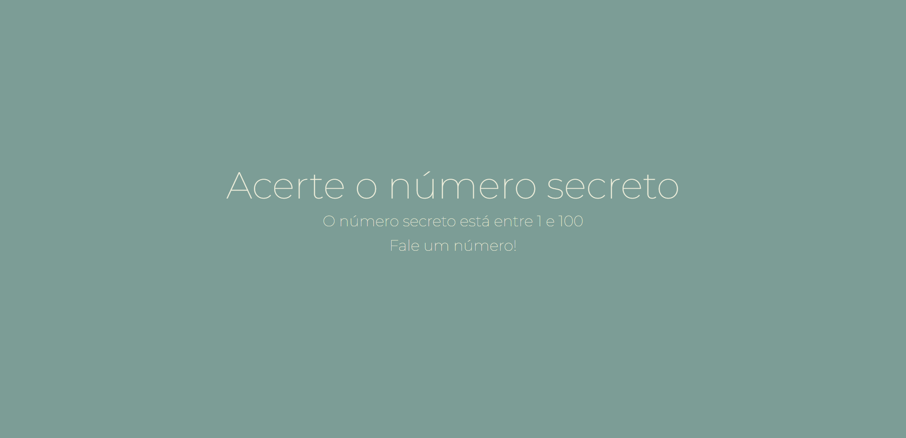

# numero-secreto
Projeto criado durante o curso JavaScript: validações e reconhecimento de voz, da Alura.

Você pode ver o resultado final [aqui](https://jessicalorenzon.github.io/numero-secreto).

